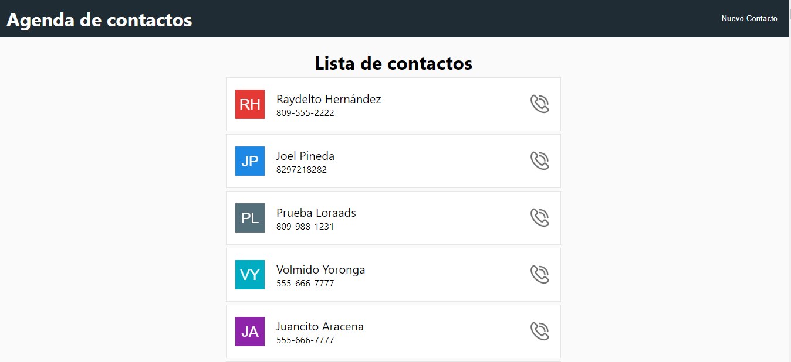
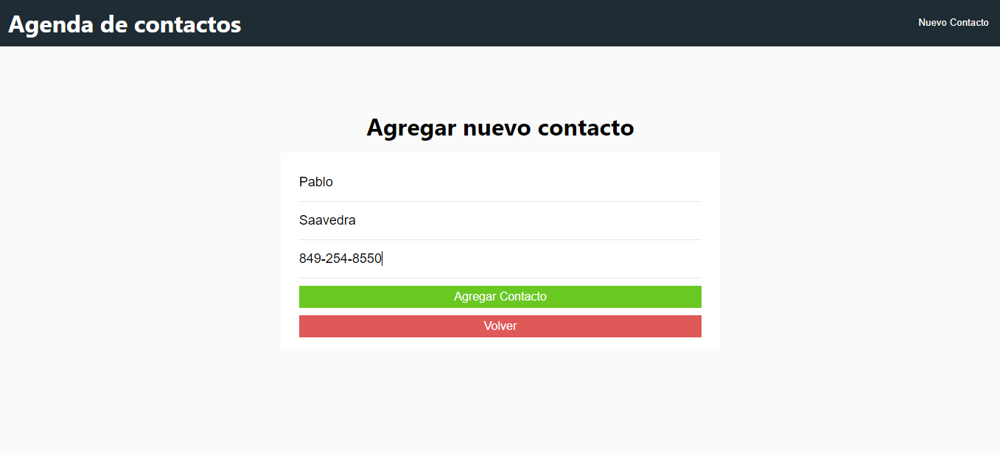
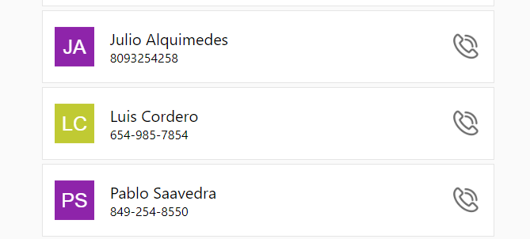
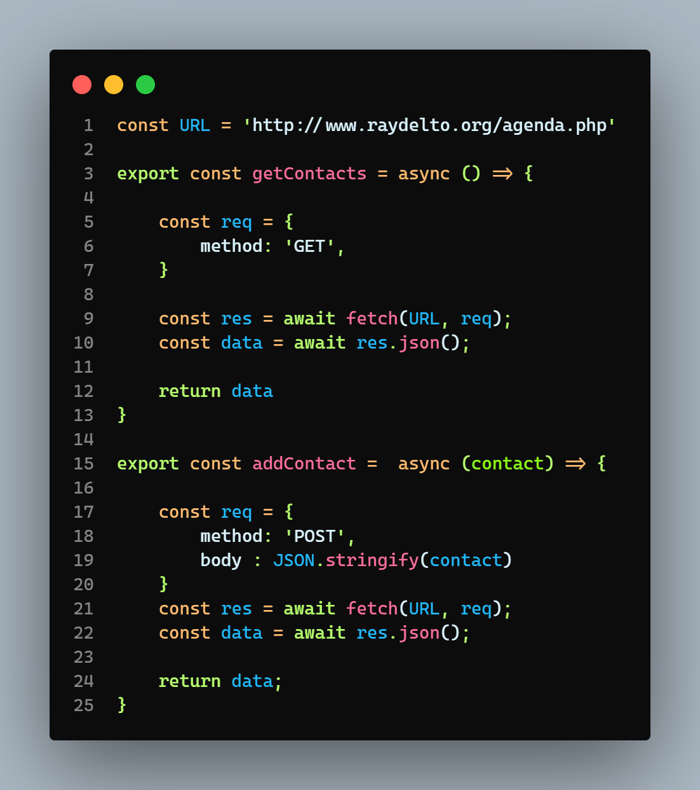

# Tarea 4 - Programación Web

- Nombre: Bryan Xavier Florentino Montero
- Matrícula: 2020-10674

## Agenda de contactos en React

Haga nueva vez la agenda pautada en la tarea #3 pero esta vez utilice la librería de Javascript React. Haga un componente para mostrar el listado de contactos y un componente para agregar nuevos contactos. Ambos componentes estarán contenidos en un componente padre.

## Capturas de pantalla

### Ver lista de contactos

### Guardar un nuevo contacto

### Ver el contacto guardado

### Peticiones HTTP con Fetch
